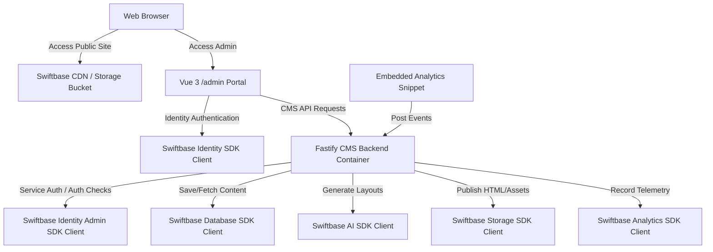
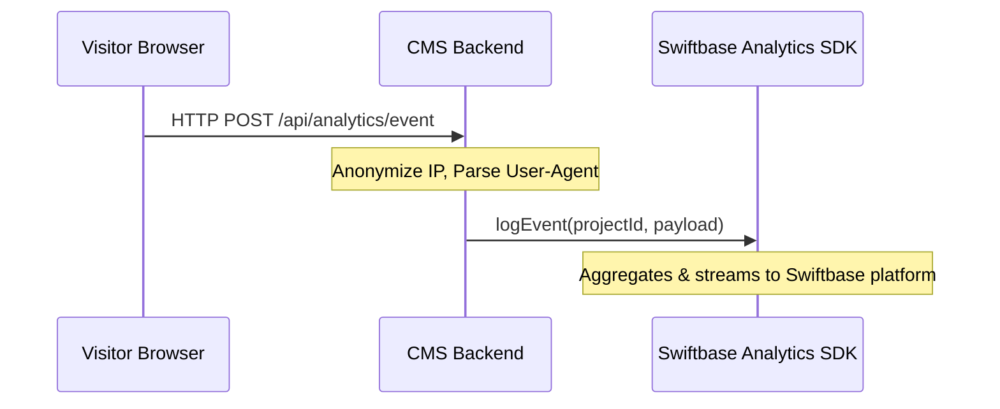

# Swiftbase CMS (SBCMS) - Architectural Design Document

This document outlines the software architecture, data models, and system design for the new Content Management System (SBCMS) built under the `swiftbase/cms` workspace. SBCMS is designed as an example project that can be easily distributed to customers. It fully leverages Swiftbase's developer platform features exclusively via the official `swiftbase-sdk` (frontend) and `swiftbase-admin-sdk` (backend).

---

## 1. System Architecture Overview

SBCMS follows a Jamstack hybrid model. Page authoring and settings management are handled via a dynamic Vue 3 Single Page Application (SPA) `/admin` portal. Public-facing web pages are compiled ahead-of-time (static site generation) and deployed directly to **Swiftbase Storage**, serving visitors globally via the high-speed CDN.

All interactions with database records, file uploads, AI generation, and event analytics are strictly managed through Swiftbase SDK client interfaces, ensuring no direct database connections or raw infrastructure dependencies.



### 1.1. Technology Stack
*   **CMS Backend:** Fastify (TypeScript), Node.js.
*   **Admin Portal (`/admin`):** Vue 3 (Composition API), Vite, Tailwind CSS, DaisyUI.
*   **SDK Integrations:**
    *   **Frontend:** `swiftbase-sdk` (Identity, Authentication, profile management).
    *   **Backend:** `swiftbase-admin-sdk` (Database client, Storage client, Analytics logger, AI agent client).
*   **Containerization:** Single unified Dockerfile for building and running the CMS backend and compiling/serving the admin frontend.

---

## 2. Core Modules & Functionality

### 2.1. Identity & Access Control
Authentication and administrative session validation are handled securely via **Swiftbase Identity**.
*   **Admin Authentication:** The `/admin` portal utilizes the `swiftbase-sdk` to redirect users to the login screen and fetch security tokens.
*   **Role-Based Access Control (RBAC):** Backend route handlers use the `swiftbase-admin-sdk` to verify user permissions and roles (`admin`, `editor`, `author`) before executing write operations.
*   **Session Management:** Handled dynamically by passing the Bearer tokens in headers, verified by the backend via the Identity SDK.

### 2.2. Page Builder (GrapesJS Integration)
A drag-and-drop editor is integrated into the admin portal using GrapesJS.
*   **Components & Blocks:** Tailored Tailwind CSS components registered as blocks.
*   **Asset Management:** Images and assets uploaded through GrapesJS are dispatched to the CMS backend, which generates pre-signed upload URLs using the **Swiftbase Storage SDK** client.
*   **Code Export:** Compiles page layouts into clean HTML and Tailwind styles, ready for static distribution.

### 2.3. Publishing Pipeline (Ahead-of-Time Compilation)
When a page is published in the Admin portal:
1.  **Rendering:** The CMS backend compiles the GrapesJS JSON representation into static HTML/CSS files.
2.  **Asset Push:** The CMS backend uses the **Swiftbase Storage SDK** client to upload these files directly to the public-facing storage bucket (`/prd_storage/sites/`).
3.  **Distribution:** The uploaded files are served instantly from the Swiftbase Storage CDN cache.

### 2.4. AI Template Assistant
An inline assistant powered by **Swiftbase AI** is integrated into the builder.
*   **Prompting:** The user prompts the assistant (e.g., *"Make a dark grid layout for 3 features"*).
*   **AI Completion:** The Fastify backend forwards the query to Swiftbase AI via the AI SDK client.
*   **Injection:** The AI returns structured JSON matching GrapesJS block schemas, which is immediately rendered on the canvas.

### 2.5. Blog Module
A toggleable blog feature accessible in the settings page.
*   **Content Creation:** Blog entries are written using a QuillJS rich text editor.
*   **Storage:** Blog posts are saved using the **Swiftbase Database SDK** client.
*   **Static Generation:** Enabling the module rebuilds the `/blog` list page and individual post routes `/blog/:slug`, saving them to Swiftbase Storage.

### 2.6. E-Commerce Store & Stripe
A toggleable e-commerce catalog module.
*   **Product Listings:** Stored in the database via the **Swiftbase Database SDK** client. Includes name, description, price, and media assets.
*   **Stripe Settings:** API keys are configured under Settings, securely saved in the database, and retrieved at runtime.
*   **Purchases & Affiliates:** Product checkouts redirect users to Stripe Checkout sessions created dynamically by the backend. Products can optionally feature affiliate link redirects for external sellers.

---

## 3. Database Schema Layout (Swiftbase Database SDK)

All schemas are managed declaratively using the Database Client configuration from `swiftbase-admin-sdk`.

### 3.1. Collections / Tables
*   `cms_settings`
    *   `id`: string (ULID)
    *   `projectId`: string
    *   `siteTitle`: string
    *   `isBlogEnabled`: boolean
    *   `isStoreEnabled`: boolean
    *   `stripePublishableKey`: string
    *   `stripeWebhookSecret`: string
*   `cms_pages`
    *   `id`: string (ULID)
    *   `slug`: string
    *   `title`: string
    *   `grapesHtml`: string
    *   `grapesCss`: string
    *   `grapesComponents`: json
    *   `grapesStyles`: json
    *   `seoMetadata`: json
    *   `isPublished`: boolean
*   `cms_posts` (Blog posts)
    *   `id`: string (ULID)
    *   `slug`: string
    *   `title`: string
    *   `content`: string
    *   `excerpt`: string
    *   `featureImage`: string
    *   `status`: string (draft / published)
    *   `seoMetadata`: json
    *   `publishedAt`: timestamp
*   `cms_products` (Store catalog)
    *   `id`: string (ULID)
    *   `slug`: string
    *   `name`: string
    *   `description`: string
    *   `priceCents`: number
    *   `stripePriceId`: string
    *   `stripeProductId`: string
    *   `images`: json (array)
    *   `affiliateLinks`: json (array of `{sellerName, url, priceCents}`)
*   `cms_purchases` (Order tracking)
    *   `id`: string (ULID)
    *   `productId`: string
    *   `stripeSessionId`: string
    *   `customerEmail`: string
    *   `amountTotalCents`: number
    *   `status`: string (pending / completed / refunded)

---

## 4. Web Analytics Architecture

SBCMS features embedded analytics utilizing the official **Swiftbase Analytics SDK**.



### 4.1. Event Ingestion
1.  **Script Ingestion:** A light tracking snippet is embedded on all compiled public pages.
2.  **Tracking payload:** Listens for `pageview`, `blog_read`, `purchase`, and custom goals, sending device type, geolocation country code, referrer, and paths to `/api/analytics/event` on the CMS backend.
3.  **Relaying:** The backend receives the request, sanitizes/anonymizes user data, and relays the event log via the **Swiftbase Analytics SDK** client:
    ```typescript
    await analyticsClient.logEvent({
      projectId,
      eventType: "pageview",
      payload: { path, referrer, device, countryCode }
    });
    ```

### 4.2. Analytics Dashboards (Vue 3 /admin)
The analytics panel queries historical records via the **Swiftbase Analytics SDK** client:
*   **Visitor Geo-Choropleth:** Displays visitor map colorized by traffic weight using geo-aggregates.
*   **User Breakdown:** Pie charts showing mobile vs. desktop ratios and browser share statistics.
*   **Conversion Funnels:** Graph representing conversion goals configured dynamically by the user (e.g. Stripe checkout start -> order completion).

---

## 5. UI/UX & Style System

The `/admin` portal will strictly respect the Swiftbase design principles:
*   **Three-Way Theme Engine:** Fully supports `light`, `dark`, and `auto` (detects OS configuration using standard window matchMedia API).
*   **Styling System:** Handled via Tailwind CSS utilities and custom DaisyUI components.
*   **Aesthetics:** Heavy typography headers (`font-black`), rounded card boundaries (`rounded-3xl`), glassmorphic panels (`backdrop-blur-md`), and micro-animations for clicks and transitions.

---

## 6. Distributable Deployment Structure (Dockerfile)

SBCMS is designed to be easily packaged and distributed. Below is the multi-stage `Dockerfile` configured to compile the Vue 3 `/admin` assets and run the Node.js Fastify backend server.

```dockerfile
# Stage 1: Build the Vue 3 Admin Portal
FROM node:20-alpine AS frontend-builder
WORKDIR /build/frontend
COPY package*.json ./
COPY frontend/package*.json ./frontend/
RUN npm ci --workspace=frontend
COPY shared/ ../shared/
COPY frontend/ ./frontend/
RUN npm run build --workspace=frontend

# Stage 2: Build the Fastify Backend
FROM node:20-alpine AS backend-builder
WORKDIR /build/backend
COPY package*.json ./
COPY backend/package*.json ./backend/
RUN npm ci --workspace=backend
COPY shared/ ../shared/
COPY backend/ ./backend/
RUN npm run build --workspace=backend

# Stage 3: Production Runner
FROM node:20-alpine AS runner
WORKDIR /app
ENV NODE_ENV=production
COPY package*.json ./
COPY backend/package*.json ./backend/
RUN npm ci --omit=dev --workspace=backend

# Copy builds from previous stages
COPY --from=backend-builder /build/backend/dist ./backend/dist
COPY --from=frontend-builder /build/frontend/dist ./frontend/dist

EXPOSE 3000
CMD ["node", "backend/dist/index.js"]
```
